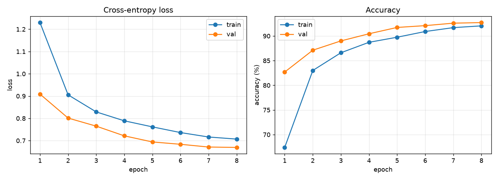
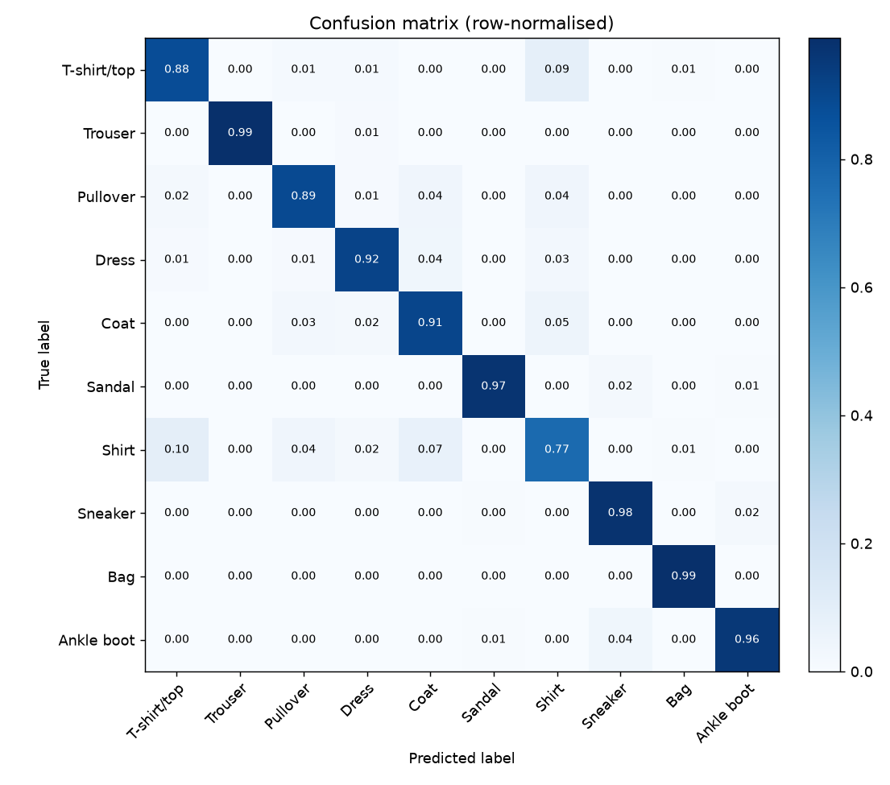
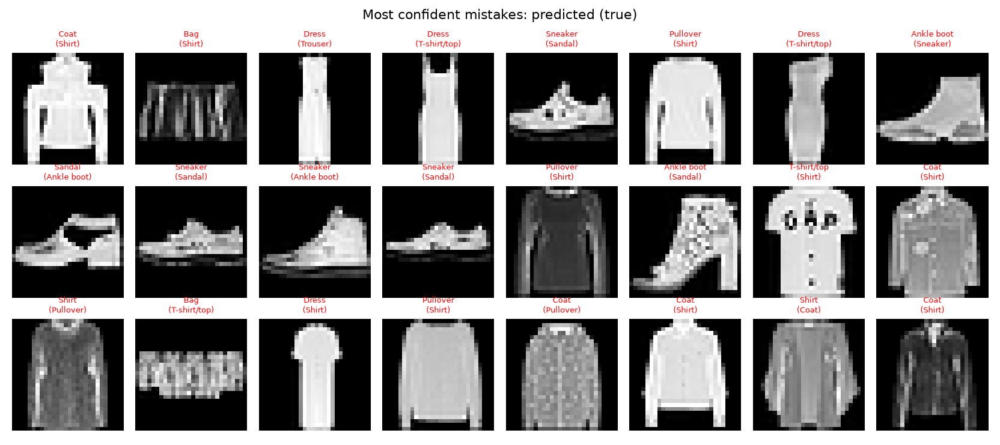

# Fashion-MNIST image classification with PyTorch

An end-to-end, CPU-friendly image-classification project: a small VGG-style
CNN trained on [Fashion-MNIST](https://github.com/zalandoresearch/fashion-mnist)
(70k grayscale 28×28 images, 10 clothing classes), with a proper
train / validation / test protocol, checkpoints, evaluation plots, tests and a
CLI to classify your own photos.

<!-- RESULTS:BEGIN -->
| Model | Params | Epochs | Val acc | **Test acc** | Macro F1 | Train time (2-core CPU) |
|-------|-------:|-------:|--------:|-------------:|---------:|------------------------:|
| `cnn` (SimpleCNN) | 584k | 8 | 92.72 % | **92.42 %** | 0.9241 | 29 min |
| `mlp` (baseline) | 535k | 8 | 86.57 % | **86.00 %** | 0.8586 | 2 min |
<!-- RESULTS:END -->

Both models use the identical data split, optimiser and schedule — the only
difference is the architecture, so the ~6.4-point gap is what the
convolutional inductive bias buys on this task. (Copies of the plots and
metrics live in [`assets/`](assets/); `runs/` itself is git-ignored.)

| Training curves | Confusion matrix (test set) |
|---|---|
|  |  |

Validation accuracy tracks slightly *above* training accuracy throughout —
expected here, because the training numbers are measured with dropout active
and on augmented images, while validation is clean. The curves are still
rising gently at epoch 8, so more epochs would squeeze out a little more.

**Where the errors are.** Nine of the ten classes score 88–99 %; *Shirt*
is the outlier at 77 % recall, and its confusions are almost entirely with
T-shirt/top (10 %), Coat (7 %) and Pullover (4 %). The most confident
mistakes make it clear why — many are genuinely ambiguous at 28×28:



## Project layout

```
fashion-mnist-cnn/
├── fmnist/                 # importable package — all reusable code lives here
│   ├── data.py             #   dataset, transforms, train/val/test loaders
│   ├── model.py            #   SimpleCNN + MLP baseline, build_model()
│   ├── engine.py           #   train_one_epoch / evaluate / predict loops
│   ├── utils.py            #   seeding, device, config, checkpoints
│   └── visualize.py        #   curves, confusion matrix, image grids
├── configs/default.yaml    # all hyper-parameters in one place
├── train.py                # CLI: train a model, save best/last checkpoints + curves
├── evaluate.py             # CLI: test-set metrics, confusion matrix, mistake gallery
├── predict.py              # CLI: classify your own image files
├── tests/                  # pytest suite (unit + small integration tests)
├── requirements.txt
└── runs/                   # created by train.py (checkpoints are git-ignored)
```

## Setup

```bash
# from the repository root
python3 -m venv .venv && source .venv/bin/activate
pip install -r fashion-mnist-cnn/requirements.txt
cd fashion-mnist-cnn
```

> Installing `torch` from PyPI pulls the CUDA build (~1 GB). If you only have a
> CPU you can save space with
> `pip install torch torchvision --index-url https://download.pytorch.org/whl/cpu`.

### Data

`train.py` asks torchvision to download Fashion-MNIST into `data/` on first
run. If the download mirror is unreachable from your network, grab the four
`*-ubyte.gz` files from the
[official repo](https://github.com/zalandoresearch/fashion-mnist/tree/master/data/fashion),
gunzip them into `data/FashionMNIST/raw/` and torchvision will pick them up.

## Usage

```bash
# train the CNN with the defaults in configs/default.yaml (≈3-4 min/epoch on CPU)
python train.py

# quick sanity run
python train.py --epochs 1 --limit-train 2000 --out runs/quick

# the fully-connected baseline
python train.py --model mlp --out runs/mlp

# evaluate the best checkpoint on the untouched test split
python evaluate.py --checkpoint runs/cnn/best.pt

# classify your own photos (light garment on dark background, like the dataset;
# use --invert for the opposite)
python predict.py my_shoe.jpg --checkpoint runs/cnn/best.pt

# tests
python -m pytest
```

Every run directory contains `config.json` (the resolved config),
`history.json`, `curves.png`, `best.pt` / `last.pt`, and after `evaluate.py`
also `test_metrics.json`, `confusion_matrix.png`, `predictions.png` and
`mistakes.png`.

## What's inside, and why

**Data protocol.** The official 60k training images are split 54k / 6k into
train / validation with a fixed seed. The model is selected on validation
accuracy and the 10k test set is touched exactly once, by `evaluate.py`. The
train and validation splits are two `Subset`s over disjoint indices of the
same files, so augmentation applies only to training images.

**Augmentation.** Random 2-px-padded crops and horizontal flips. That's
enough to close most of the train/val gap on a dataset this small; heavier
augmentation hurts at 28×28.

**Model.** `SimpleCNN` = 3 × (Conv-BN-ReLU-Conv-BN-ReLU-MaxPool-Dropout) with
32/64/128 channels, then a 256-unit head. BatchNorm makes it train quickly
with a fairly high learning rate; dropout in both the conv blocks and the head
regularises it. The `MLP` baseline has a similar parameter count but no
convolutional inductive bias — compare their test accuracies to see what
convolutions buy you.

**Optimisation.** AdamW with weight decay 5e-4, `OneCycleLR` (peak lr 3e-3,
25 % warm-up) stepped per batch, cross-entropy with label smoothing 0.1.
This recipe reaches a strong result in under 10 epochs without any tuning.

**Reproducibility.** `set_seed()` seeds Python, NumPy and PyTorch; the
train/val split is seeded independently; each run saves its resolved config.

## Where to take it next

- **Confusions.** Look at `mistakes.png` — almost all errors are
  Shirt ↔ T-shirt/top ↔ Pullover ↔ Coat. Try test-time augmentation or a
  slightly wider network and see whether that cluster improves.
- **Architecture.** Swap `SimpleCNN` for a small ResNet (add skip connections)
  — a few lines in `model.py`, everything else stays the same.
- **Hyper-parameter search.** `train.py --lr … --out runs/lr_…` in a loop, then
  compare `history.json` files.
- **Interpretability.** Grad-CAM on `model.features[-1]` to see which pixels
  drive each prediction.
- **Serving.** Export to ONNX / TorchScript and wrap `predict.py` in a tiny
  FastAPI endpoint.
- **New dataset.** `data.py` is the only file that knows about Fashion-MNIST.
  Point it at CIFAR-10 (`in_channels=3`, 32×32) for a harder problem.
